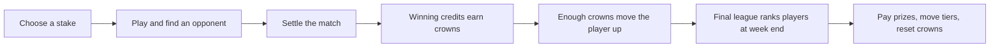

# Game flow and measurement plan

<!-- scenario-quick-reference:start -->
**Before reading:** these are simulated USD amounts; the app currently uses demo credits. A **pool** is shared among a league’s prize winners. **Profit** always belongs to the platform: fees minus modeled costs and rewards. **Available cash** is money left after protecting existing obligations and reserves.

**Low-cash decision:** offer $10,000.00 for one retention week, assuming $10,000.00 of new company cash is received first. If earnings after costs halve, that week loses $3,148.25, but current-plus-next-week profit remains $2,179.25. [See the worked example](REWARD_ANALYSIS.md#why-the-low-cash-pool-can-be-larger).

**Cumulative profit:** in a scenario, add its current week and next forecast week. In the weekly report, add the weeks in order. Start at zero in both examples. Do not add different scenarios together or count new company cash as profit.

Quick reference: what each case name means

- **Normal week (`baseline`):** the usual assumed players, games and stakes; our comparison point.
- **Low available cash (`low_liquidity`):** normal gameplay, less starting cash, plus new company funding for the larger one-week reward offer.
- **Higher wagers (`high_wager`):** stakes rise and players make about 10% more attempts; more fees support larger normal-policy pools.
- **Master players go quiet (`master_quiet`):** all but one original Master player stop; fees fall, but existing prizes are still owed.
- **More games, smaller stakes (`more_games_low_stakes`):** attempts rise about 50%, but lower stakes reduce fees and each attempt still costs money.
- **Technical problems (`outage`):** fewer attempts and more unfinished runs; rewards use a more cautious earnings forecast.
- **Four large flagged accounts (`whale_surge`):** wagering is concentrated; fees involving these deliberately flagged mock accounts are set aside. Large wagers alone do not prove abuse.
- **Cash shortfall (`reserve_deficit`):** existing obligations and reserves exceed available cash; new pools are blocked.
- **Earlier examples (`prior_2`, `prior_1`):** fabricated weeks at roughly 90% and 95% of normal attempts, used to smooth the forecast; they are not observed history.
- **Nobody plays (`platform_quiet`):** used only in the weekly report; no fees or earned prizes, but operating costs continue.

The eight-week report follows the ordinary policy. It does not include the new low-cash retention campaign or its company funding.

<!-- scenario-quick-reference:end -->

## How a player moves through the game

These are the repository's current rules. The app uses **demo dollars**; top-ups and withdrawals change credits without transferring real cash. Cash forecasts in this study are hypothetical. [Wallet source](../../Scripts/FirebaseFunctions/Bet/service.js#L225).

1. **Enter.** Stake $1–$20 in whole dollars on Jungle Swing. The wallet is debited; only one playing attempt is allowed at a time.
2. **Find an opponent and play.** Match with the oldest available entry at the same game and stake from another player. Play can begin before matching. Opponents can belong to different leagues.
3. **Settle.** The higher completed score wins. A completed attempt also beats a forfeited attempt. The winner receives 90% of the combined stakes; the platform keeps 10%. Ties and double forfeits refund both stakes. Unmatched entries expire after 15 minutes and are refunded without a fee.
4. **Earn crowns and move up.** Trusted winning wallet credits earn one crown per accumulated dollar, including the returned stake. Reaching a promotion threshold immediately moves the player up, preserving their crowns. Losses, refunds and league prizes earn no crowns.
5. **Rank the final league.** At weekly close, compete in the league reached after immediate promotions. Rank by crowns, then earliest time reaching that total, then user ID. Currently, one crown qualifies a player for prize ranking.
6. **Award and reset.** Prize winners move up one league unless already Master. Other positive-crown players stay. Zero-crown players move down, with Bronze as the floor. Crowns reset for the new week.

[Entry and matching](../../Scripts/FirebaseFunctions/Bet/service.js#L270), [settlement](../../Scripts/FirebaseFunctions/Bet/service.js#L90), [crowns and promotion](../../supabase/migrations/20260910050000_weekly_leagues.sql#L155), [weekly awards and reset](../../supabase/migrations/20260910050000_weekly_leagues.sql#L106).

### A $10 match makes the accounting concrete

Alice and Bob each stake **$10**. Alice wins: **$20 combined stakes = $18 credited to Alice + $2 platform fee**. Count that fee once. Deduct operating costs and league prizes to calculate platform profit.

Alice earns **18 crowns**, including her returned stake. Starting from zero in Bronze, she passes the 10-crown threshold and enters Silver, competing for Silver's prize. Crowns measure winning credits, not deposits or platform profit.

**One qualifier receives the whole league pool.** In `master_quiet`, the sole current Master qualifier gets $5,000. With zero qualifiers, nobody gets a prize.

## What exists today, and what this analysis proposes

**Columns:** **Rule** names the decision. **Current app** describes the source code. **Proposed analysis** describes the policy being modeled, which would need implementation before use.

| Rule | Current app | Proposed analysis |
| --- | --- | --- |
| Total weekly prizes | Fixed $8,376 across eight leagues | Recalculate future pools from activity, costs, cash and the chosen policy |
| Minimum crowns for a prize | 1 in every league | Bronze to Master: 1 / 5 / 15 / 40 / 100 / 200 / 400 / 800 |
| Pool progression | Fixed increasing amounts | Every funded higher league has a larger pool than the previous league |
| Low-cash retention week | No funding or loss-budget check | $10,000 total pool, supported by assumed $10,000 company funding; temporary loss allowed |
| Prize protection | Active rules are snapshotted | Honor existing promises; change only future offers |

**Clarifications:**

- Prize eligibility and promotion are separate rules. Meeting the proposed minimum lets someone compete for a prize; they still need a sufficiently high rank. Promotion thresholds remain unchanged.
- The campaign is one week, not a recurring promise. Its total exceeds today's $8,376, but its Diamond and Master pools are individually smaller than today's configured amounts.
- A blocked or zero future pool is an analytical decision, not a valid drop-in database configuration. Crown gates and a pause/restart mechanism require implementation.

See [REWARD_ANALYSIS.md](REWARD_ANALYSIS.md) for the campaign ladder and funding. The model does not establish that bigger prizes cause more play.

## Measure each league without confusing movement with inactivity

Keep three views of the same player: **opening league** at the week's start, **closing league** after immediate promotions, and **next opening league** after weekly awards and movement.

Use opening league to compare the same players' activity, closing league to award prizes, and next opening league to forecast the audience. Ten Gold players promoted upward are different from ten Gold players stopping play. Joining historical games to today's league hides this distinction.

**Columns:** **Question** is what the weekly review should answer. **Measure** lists the numbers to collect. **Why it matters** explains how those numbers affect prizes or profit.

| Question | Measure | Why it matters |
| --- | --- | --- |
| Are players returning? | Opening members, new/returning players, paid starters, active days, next-week return rate | Separates audience growth from existing players returning |
| Are they playing more? | Attempts per paid starter and their distribution | More games can increase fees and service costs |
| Are they staking more? | Total stakes, average and median stake, same-player changes | More attempts can still generate less money if stakes fall |
| Can they find opponents? | Match rate, waiting time, unmatched refunds by stake and time of day | A busy platform can still have empty queues at a particular stake |
| Are games completing reliably? | Forfeits, ties, crashes, timeouts and decisive matches | Only decisive settlements generate match fees |
| Is the prize contest attractive? | Qualifiers, paid places, crowns near the cutoff, promotions and reward concentration | A large advertised pool may benefit very few people |
| What does the platform earn? | Fees, excluded suspect fees, costs, prizes, weekly and cumulative profit | Measures whether the reward expense is affordable over the chosen horizon |
| Is cash available? | Settled cash, player obligations, promised prizes, buffers and cleared company funding | Positive profit does not necessarily mean cash is available today |

**Clarifications:**

- A **paid starter** made at least one successfully reserved attempt. Here, a **game attempt** is one player's entry; a matched contest has two attempts. **Total stakes**, also called handle, is the sum of entry stakes, not revenue.
- Matching liquidity means available opponents. Treasury liquidity means available cash. The `low_liquidity` case changes the latter while keeping gameplay unchanged.
- Compare the same players as well as league totals. New players, promotions, holidays or a release can change averages without changing existing players' behavior.

Investigate concentrated activity, repeated opponent pairs and abnormal forfeits; large stakes alone do not establish abuse.

## Turn those measurements into a weekly decision

1. **Reconcile the completed week.** Match entry debits, refunds, winning credits and league awards to the ledger. Count each match fee once. Include inactive members and unresolved entries.
2. **Explain the change.** Break total stakes into paid starters × attempts per starter × average stake. Then examine how much settled decisively, was refunded or remained unfinished. This distinguishes fewer users from fewer games or smaller stakes.
3. **Forecast the next week.** Estimate those components and league movement separately. Start with last-week and rolling-average comparisons. Collect 8–12 weeks initially; show uncertainty, especially for small leagues.
4. **Choose the reward policy and fund it.** The ordinary policy is conservative. The retention campaign deliberately spends more. Check available cash separately from contribution and loss tolerance; new company equity supplies cash but is excluded from profit.
5. **Review weekly and cumulative results.** Platform profit is fees available to use, minus modeled costs and prize expense. A loss reduces cumulative profit. Independent cases each cover their own current-plus-next two-week branch; [WEEKLY_PROFIT.md](WEEKLY_PROFIT.md) instead sums eight consecutive weeks. Never add alternative case rows together.
6. **Check predictions.** Compare forecast and actual participation, stakes, fees and qualifiers using only information available before announcement. Test accounting separately from forecast accuracy.

The funded campaign accepts up to **$3,500 weekly loss at its selected 50% contribution stress**, also limited by positive current profit. That stress leaves **$2,179.25 two-week cumulative profit**. The 40% contribution stress breaches the weekly loss allowance. These percentages apply to contribution after costs; they are not predicted percentages of retained players. Actual losses can exceed a planning allowance, and earned prizes remain owed.

## Test whether the bigger prize actually helps

“Prizes rose and games rose” is insufficient evidence: strong activity may have caused higher prizes, while skilled or persistent players may win more anyway.

Players on the same board affect each other's ranks and prizes. Leagues also interact through opponents and promotions. Giving individuals different policies would therefore mix the effects. With the current architecture, compare preannounced platform-wide policies across enough weeks, accounting for calendar effects and behavior carried into later weeks. Separate randomized competition groups would require a product change and enough opponents in each group.

Before launch, specify the comparison, duration, funding and success measures. Track repeat participation by opening league, qualifying rates, match waits, complaints, concentrated awards, and **additional platform profit after costs and prizes**. Assess the campaign plus a stated follow-up period, such as four further weeks. This follow-up is not included in the two-week sensitivity calculation. Renew only after reviewing engagement, cumulative results and funding for the next offer; preserve prizes already announced.

<strong>Technical reference: source data, timing and reconciliation</strong>

App leaderboards show only the top 20 plus the caller. Extract complete tables, retaining IDs, cutoff and rule snapshots. [Response limits](../../Scripts/FirebaseFunctions/League/service.js#L48).

- **Attempts:** `bets`, keyed by `bet_id`, plus the successful `wallet_entries` debit. Retries with the same request must not count twice.
- **Matches and credits:** `results`, keyed by `match_id`, and `game_earnings`, keyed by `bet_id`. Joining two participant records must not double a match's fee.
- **Money:** `wallet_entries`, keyed by `wallet_entry_id`, with balances from the same cutoff. Use integer cents. Treasury and real payment records are additional hypothetical inputs in this study.
- **Crowns and league membership:** `league_crown_ledger`, `league_standings`, `league_payouts` and `league_periods.tiers`. Preserve a player-and-period key and zero-attempt members. Reconstruct transitions from opening state; mutable `league_players` is not historical membership. Immutable tier-before/tier-after events would improve attribution. [Storage](../../supabase/migrations/20260910050000_weekly_leagues.sql#L41).
- **Timing:** weeks start Monday midnight in `America/New_York`; daylight-saving changes can produce 167- or 169-hour weeks. Crowns use the server-processed settlement period, which can differ from entry week. Use `[starts_at, ends_at)` and distinguish entry, settlement and wallet-posting times. Unfinished stakes are obligations, not earned fees. [Period rules](../../supabase/migrations/20260910050000_weekly_leagues.sql#L22).
- **Prizes:** occupied rank weights are rescaled to pay the whole league pool; leftover rounding cents go to first. Normal first prizes rise under the proposed ladder, but sparse fields can reverse actual first-prize comparisons. Award delivery retries are idempotent. [Award delivery](../../Scripts/FirebaseFunctions/League/service.js#L21).
- **Current configuration:** Bronze-to-Master pools are $1 / $25 / $50 / $100 / $300 / $400 / $2,500 / $5,000. Paid places are 2 / 3 / 5 / 5 / 10 / 10 / 10 / 10. Immediate promotion thresholds are 10 / 50 / 150 / 350 / 750 / 1,500 / 3,000 cumulative crowns; Master has no higher tier. [Full rank weights and settings](../../supabase/migrations/20260910050000_weekly_leagues.sql#L12).

In the chronological model, cash less wallet and deferred-fee liabilities changes by platform profit. Deposits and withdrawals move cash and wallet liabilities equally; awarded prizes become wallet obligations. Check this reconciliation alongside boundary and retry tests. [Existing backend tests](../../test/leagues.integration.test.js).

**Evidence limits:** synthetic records cannot establish real player response. Treasury, acquisition, crash, historical-tier and integrity data still need collection. Client score checks do not establish complete abuse prevention. Add omitted business costs before real funding decisions.
