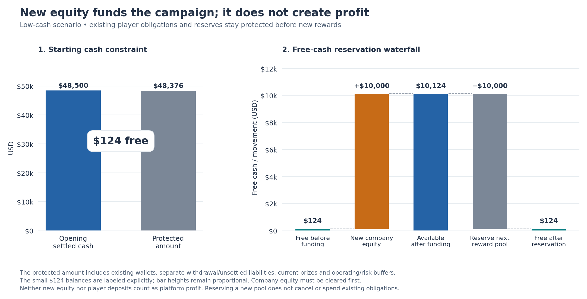
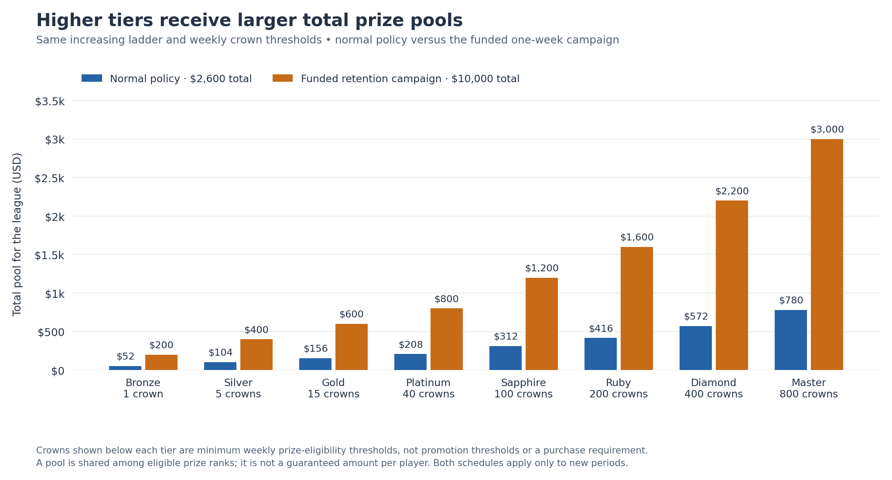

# Weekly rewards: the decision, explained

<!-- scenario-quick-reference:start -->
**Before reading:** these are simulated USD amounts; the app currently uses demo credits. A **pool** is shared among a league’s prize winners. **Profit** always belongs to the platform: fees minus modeled costs and rewards. **Available cash** is money left after protecting existing obligations and reserves.

**Low-cash decision:** offer $10,000.00 for one retention week, assuming $10,000.00 of new company cash is received first. If earnings after costs halve, that week loses $3,148.25, but current-plus-next-week profit remains $2,179.25. [See the worked example](REWARD_ANALYSIS.md#why-the-low-cash-pool-can-be-larger).

**Cumulative profit:** in a scenario, add its current week and next forecast week. In the weekly report, add the weeks in order. Start at zero in both examples. Do not add different scenarios together or count new company cash as profit.

<details>
<summary>Quick reference: what each case name means</summary>

- **Normal week (`baseline`):** the usual assumed players, games and stakes; our comparison point.
- **Low available cash (`low_liquidity`):** normal gameplay, less starting cash, plus new company funding for the larger one-week reward offer.
- **Higher wagers (`high_wager`):** stakes rise and players make about 10% more attempts; more fees support larger normal-policy pools.
- **Master players go quiet (`master_quiet`):** all but one original Master player stop; fees fall, but existing prizes are still owed.
- **More games, smaller stakes (`more_games_low_stakes`):** attempts rise about 50%, but lower stakes reduce fees and each attempt still costs money.
- **Technical problems (`outage`):** fewer attempts and more unfinished runs; rewards use a more cautious earnings forecast.
- **Four large flagged accounts (`whale_surge`):** wagering is concentrated; fees involving these deliberately flagged mock accounts are set aside. Large wagers alone do not prove abuse.
- **Cash shortfall (`reserve_deficit`):** existing obligations and reserves exceed available cash; new pools are blocked.
- **Earlier examples (`prior_2`, `prior_1`):** fabricated weeks at roughly 90% and 95% of normal attempts, used to smooth the forecast; they are not observed history.
- **Nobody plays (`platform_quiet`):** used only in the weekly report; no fees or earned prizes, but operating costs continue.

The eight-week report follows the ordinary policy. It does not include the new low-cash retention campaign or its company funding.

</details>
<!-- scenario-quick-reference:end -->

## The decision in one minute

For the **low-cash week**, try a **$10,000 reward pool for one week** to encourage players to return. The mock plan assumes the company first adds **$10,000 of new cash**. This funding is separate from player deposits and does not count as profit.

At the current level of play, the campaign leaves **$3,703.50 weekly platform profit**. If earnings after costs halve, it loses **$3,148.25 that week**. The current and next week combined still make **$2,179.25** in that weaker example.

For a normal week without this campaign, the model recommends **$2,600 total rewards**. The two amounts represent different choices: routine rewards and a temporary retention expense. The model does not prove that either amount improves retention. The next step is to measure whether more players return and whether the benefit justifies the expense.

## How to read the numbers

Follow the money through one game first:

1. Two players enter with **$10 each**. Total stakes are **$20**, called *handle* in the dataset.
2. A decisive result pays the winner **$18** and gives the platform a **$2 fee**. The winner’s $18 includes their original stake. Ties, double forfeits and unmatched attempts refund stakes instead.
3. The platform pays its operating costs from fees. What remains before weekly league rewards is called **contribution** in the data.
4. Subtract league rewards to get **platform profit**.

For the low-cash campaign, the weekly calculation is:

```text
$15,171.40 fees − $1,467.90 modeled costs = $13,703.50 before league rewards
$13,703.50 − $10,000.00 league rewards  =  $3,703.50 platform profit
```

**Cumulative profit** adds results over a stated period. This scenario starts at zero before the current week, makes $5,327.50 in the current week, then forecasts $3,703.50 next week: **$9,031.00 combined**. It is neither the bank balance nor company lifetime profit.

The separate [weekly report](WEEKLY_PROFIT.md) adds eight simulated weeks in order. Its running total is a different history; do not append a scenario’s forecast to it.

## Why the low-cash pool can be larger

The original small pool came from a cash constraint. **$48,500 cash − $48,376 protected money = only $124 available.** The ordinary allocation rule could use $100 of that.

The revised plan supplies new company cash before making a larger promise:

```text
$124 available + $10,000 new company cash = $10,124 available
$10,124 − $10,000 promised rewards        =    $124 left available
```



**Read the chart:** follow the money from the original cash position to the funded offer. The existing $48,376 of obligations and reserves stays protected throughout. The new $10,000 supplies cash; it does not increase profit.

At least **$9,876** of extra cash would be needed to cover the chosen pool. The example rounds funding to $10,000. Accepting a weekly loss does not create this cash. If the full offer cannot be funded, the model blocks it rather than treating owed player balances as spending money.

<details>
<summary>What makes up the protected $48,376?</summary>

- $30,000 already owed in player wallets.
- $2,000 of separate withdrawal requests and $1,000 of unsettled stakes.
- $8,376 in existing league prizes, which remain owed under the current rules.
- $5,000 kept for future operations and $2,000 kept for risk.

The first three items are existing obligations; the last two are chosen buffers. Once a prize is credited to a wallet, remove its separate prize reservation so it is counted once. Pending processor funds are not available cash. Deposits increase both cash and the amount owed to players, so they do not create free funding.

</details>

## What happens if earnings fall?

Keep the **full $10,000 reward expense** and vary the money earned after costs. This asks how much loss the business can accept; it does not predict player behavior.


**Read the chart:** 100% means the current $13,703.50 contribution repeats; 50% means only half remains. A point below zero is a weekly loss. Cumulative profit also includes the current week’s $5,327.50 profit, so a temporary loss can leave the combined result positive.

**Columns:** **Contribution level** is the fraction of current earnings after costs assumed for next week. **Before rewards** is that amount in USD. **Weekly profit** subtracts the same $10,000 pool. **Cumulative profit** adds current-week profit to that forecast, starting at zero before the current week.

| Contribution level | Before rewards | Weekly profit | Cumulative profit |
| --- | ---: | ---: | ---: |
| 100% | $13,703.50 | $3,703.50 | $9,031.00 |
| 50% | $6,851.75 | −$3,148.25 | $2,179.25 |
| 40% | $5,481.40 | −$4,518.60 | $808.90 |

**Clarifications:**

- These rows are alternative outcomes of one campaign, not three consecutive weeks. A 50% contribution level does not mean 50% fewer players, games or wagers.
- The plan allows up to $3,500 weekly loss at the chosen 50% stress, while keeping the two-week total at or above zero. The 40% example exceeds that weekly loss allowance even though cumulative profit remains positive.
- A worse result triggers a review of the next offer. It does not cancel prizes already promised or guarantee losses will stop at $3,500.

Break-even is about **73% of current contribution**. The campaign spends $9,900 more on rewards than the old $100 offer. Measure the benefit over a named follow-up period—such as the campaign plus four later weeks—before renewing it. Those later benefits are not already included in the table.

## Higher leagues get larger pools

Both proposed schedules increase from Bronze to Master. The crown minimum also rises, so higher-tier players need more fresh weekly crowns to qualify for a prize.



**Read the chart:** each amount is a whole league pool shared among its winners. Compare tiers within one schedule. The campaign increases every tier relative to the ordinary proposed schedule.

**Columns:** **League** names the tier. **Min crowns** is the proposed fresh weekly prize-eligibility threshold. **Normal pool** is its share of the $2,600 ordinary budget. **Campaign pool** is its share of the $10,000 retention budget. **Campaign profit** is the platform’s forecast profit attributed to that league after allocated costs and its pool, assuming current activity repeats.

| League | Min crowns | Normal pool | Campaign pool | Campaign profit |
| --- | ---: | ---: | ---: | ---: |
| Bronze | 1 | $52.00 | $200.00 | −$190.56 |
| Silver | 5 | $104.00 | $400.00 | −$344.76 |
| Gold | 15 | $156.00 | $600.00 | −$402.93 |
| Platinum | 40 | $208.00 | $800.00 | −$249.54 |
| Sapphire | 100 | $312.00 | $1,200.00 | −$73.53 |
| Ruby | 200 | $416.00 | $1,600.00 | $277.96 |
| Diamond | 400 | $572.00 | $2,200.00 | $725.92 |
| Master | 800 | $780.00 | $3,000.00 | $3,960.94 |
| **Total** | — | $2,600.00 | $10,000.00 | $3,703.50 |

**Clarifications:**

- Crowns come from winning credits, including returned stake; they are not a deposit requirement or player profit. Reaching the minimum makes a player eligible, but rank still decides who wins a prize.
- Players compete in their final league. Existing promotion thresholds are separate from these proposed prize minimums; current prizes still use the existing one-crown rule.
- A negative league profit means other leagues help cover its rewards. The platform total is what must reconcile; each league is not a separate bank account. The dash means a crown minimum cannot be added across tiers.
- First prizes increase across tiers when every paid rank has a qualifier. With fewer qualifiers, the pool is divided among fewer winners: one qualifier can receive the whole pool. A higher-tier pool does not guarantee a larger individual award in every possible field.

The campaign is **19.4% larger than the existing $8,376 total**, but redistributes rewards. Diamond moves from its existing $2,500 to $2,200, and Master from $5,000 to $3,000. Explain those changes explicitly; a larger total does not mean every existing tier receives an increase.

The new crown gates reduce baseline forecast qualifiers from **303 to 274**. Check whether players understand and can reasonably reach them, especially after promotion and the weekly reset.

## What changes in the other scenarios?

The cases test different reasons for changing rewards:

- **Higher wagers:** gross fees rise from $15,171.40 to $20,134.00. The normal rule raises next pools to $3,100, while holding back part of the earnings increase.
- **More games at smaller stakes:** attempts rise, but gross fees fall to $11,795.60. More activity alone does not mean more money for rewards.
- **Master players go quiet:** the existing lone Master qualifier still receives $5,000. Current platform profit is −$574.52; already-promised prizes cannot be cut after the fact.
- **Technical problems or flagged accounts:** poorer quality and uncertain fee income lead to smaller normal-policy budgets.
- **Cash shortfall:** the next offer is blocked even when the unchanged-activity profit calculation looks positive. Profit and available cash answer different questions.

[Compare all scenarios visually and see the league details](SCENARIO_RESULTS.md). These cases reuse fictional player identities and are alternatives, not a timeline or independent real-world samples.

## How to choose the following week

1. **Check behavior by starting league.** Count returning players, attempts per player and stakes per attempt. Track where promoted players go, so movement is not mistaken for churn.
2. **Check money earned and money available.** Reconcile collected fees, costs, existing prizes, player liabilities and usable company cash separately.
3. **Assess the campaign.** Compare repeat play, qualification, match waits and complaints alongside weekly and cumulative profit. A larger pool is useful only if its measured benefit justifies the expense.
4. **Make the next offer before play begins.** The campaign lasts one week. Renew only after a fresh funding and results review; preserve prizes already promised.

The [game flow and measurement plan](FLOW_AND_DATA_PLAN.md) explains what to record and how to evaluate results without confusing promotion, higher stakes or busy weeks with a reward effect.

<details>
<summary>Calculation reference: how the ordinary budget and campaign limit work</summary>

Let N be fees after suspect-fee withholding and modeled costs, before league rewards. Independent cases assume $125 deposit-processing costs, $0.02 per attempt, $1,000 fixed costs and $100 fraud losses. Profit excludes unmodeled taxes and financing costs.

The ordinary rule blends 50% of current N, 30% of the nearer example and 20% of the older example. Take the smaller of current N and this blend, floor at zero, keep a 20% forecast buffer, and offer 25% of the remainder for rewards. Multiply by 0.50 after the modeled outage or 0.75 for flagged concentration. These percentages are chosen policy settings, not measured optimal values.

Cash availability and a 25% pool-growth limit can reduce that amount. Baseline allows $2,631.70 before rounding. The tier weights are 1 / 2 / 3 / 4 / 6 / 8 / 11 / 15; one whole-dollar unit costs $50 across all leagues, producing $2,600 allocated rewards. Each tier also has a $100-per-projected-qualifier cap, using one possible late qualifier if none are forecast. A scarce tier reduces the whole ordinary ladder so the order stays increasing.

The one-week campaign replaces the ordinary earnings and growth limits. Its loss allowance is the smaller of $3,500 and positive current profit. At the 50% stress, $6,851.75 contribution plus $3,500 allowed loss supports a maximum pool of $10,351.75. The chosen $10,000 fits that limit and the cash and qualifier checks. If any check prevents the full campaign target, publication is blocked.

The model uses 384 fictional identities and 62,912 terminal match/refund events across ten cases. The two earlier cases only illustrate smoothing. The separate eight-week path carries cash, liabilities and tiers forward; it uses different deposit flows and therefore $500 ordinary-week processing costs. Neither dataset estimates how players respond to rewards.

[Source settlement rules](../../Scripts/FirebaseFunctions/Bet/service.js) · [Source league rules](../../supabase/migrations/20260910050000_weekly_leagues.sql) · [Inputs, outputs and commands](README.md)

</details>

**Recommendation:** fund the modeled $10,000 low-cash campaign for one week, accept the illustrated temporary loss if needed, and judge it using both cumulative profit and measured player return. Use the ordinary $2,600 schedule for the unchanged baseline case. These are proposed planning rules; the demo app needs the new crown eligibility and funding controls implemented before activation.
