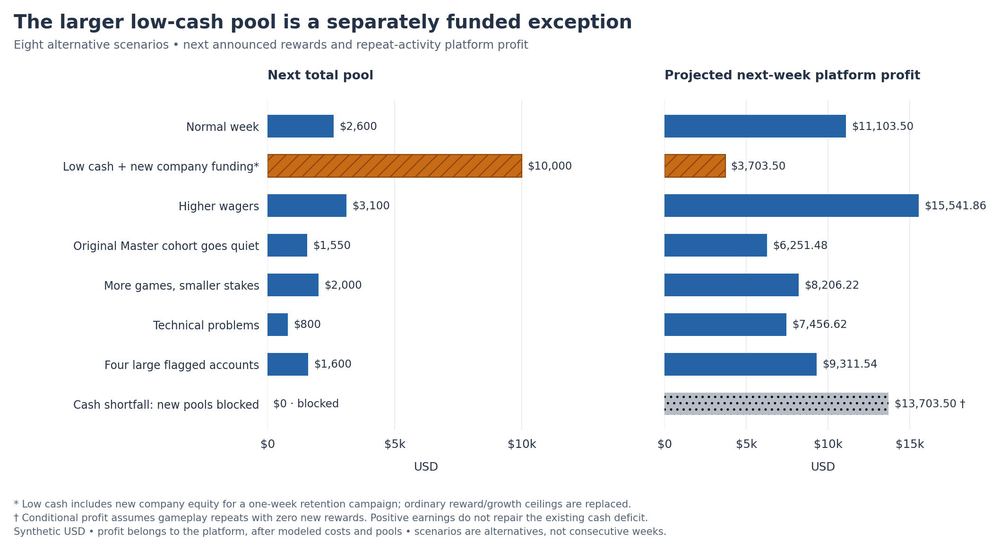
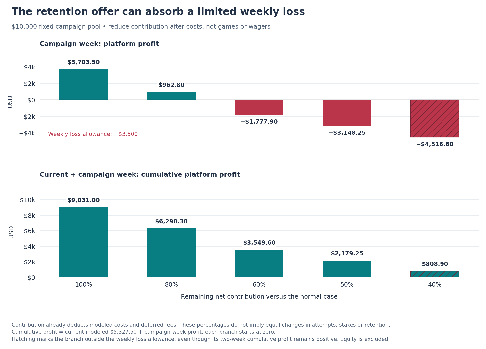

# What happens to rewards in each scenario?

<!-- scenario-quick-reference:start -->
**Before reading:** these are simulated USD amounts; the app currently uses demo credits. A **pool** is shared among a league’s prize winners. **Profit** always belongs to the platform: fees minus modeled costs and rewards. **Available cash** is money left after protecting existing obligations and reserves.

**Low-cash decision:** offer $10,000.00 for one retention week, assuming $10,000.00 of new company cash is received first. If earnings after costs halve, that week loses $3,148.25, but current-plus-next-week profit remains $2,179.25. [See the worked example](REWARD_ANALYSIS.md#why-the-low-cash-pool-can-be-larger).

**Cumulative profit:** in a scenario, add its current week and next forecast week. In the weekly report, add the weeks in order. Start at zero in both examples. Do not add different scenarios together or count new company cash as profit.

Quick reference: what each case name means

- **Normal week (`baseline`):** the usual assumed players, games and stakes; our comparison point.
- **Low available cash (`low_liquidity`):** normal gameplay, less starting cash, plus new company funding for the larger one-week reward offer.
- **Higher wagers (`high_wager`):** stakes rise and players make about 10% more attempts; more fees support larger normal-policy pools.
- **Master players go quiet (`master_quiet`):** all but one original Master player stop; fees fall, but existing prizes are still owed.
- **More games, smaller stakes (`more_games_low_stakes`):** attempts rise about 50%, but lower stakes reduce fees and each attempt still costs money.
- **Technical problems (`outage`):** fewer attempts and more unfinished runs; rewards use a more cautious earnings forecast.
- **Four large flagged accounts (`whale_surge`):** wagering is concentrated; fees involving these deliberately flagged mock accounts are set aside. Large wagers alone do not prove abuse.
- **Cash shortfall (`reserve_deficit`):** existing obligations and reserves exceed available cash; new pools are blocked.
- **Earlier examples (`prior_2`, `prior_1`):** fabricated weeks at roughly 90% and 95% of normal attempts, used to smooth the forecast; they are not observed history.
- **Nobody plays (`platform_quiet`):** used only in the weekly report; no fees or earned prizes, but operating costs continue.

The eight-week report follows the ordinary policy. It does not include the new low-cash retention campaign or its company funding.

<!-- scenario-quick-reference:end -->

These are **alternative versions of one week**, followed by a next-week forecast. They are not consecutive weeks. All amounts are synthetic USD; “profit” always means platform operating profit.

## Compare the decisions

*Read each case as its own comparison: rewards are the total across eight leagues, and profit is what remains after costs and rewards. Low liquidity has the largest reward offer because it uses a separately funded retention campaign. These bars assume unchanged activity.*

**The calculation:** `next profit = contribution before league rewards − next pools`. `cumulative profit = current profit + next profit`. Cumulative profit here covers two weeks and starts at zero for each case.

**Columns:** **Case** is the alternative week. **Before rewards** is match-fee revenue after modeled costs and suspect-fee withholding. **Current profit** subtracts existing awards from that amount. **Next pools** is the total proposed reward budget for all eight leagues. **Next profit** subtracts Next pools from repeated Before rewards. **Cumulative profit** adds Current profit and Next profit.

| Case | Before rewards | Current profit | Next pools | Next profit | Cumulative profit |
| --- | --- | --- | --- | --- | --- |
| baseline | $13,703.50 | $5,327.50 | $2,600.00 | $11,103.50 | $16,431.00 |
| low_liquidity | $13,703.50 | $5,327.50 | $10,000.00 | $3,703.50 | $9,031.00 |
| high_wager | $18,641.86 | $10,265.86 | $3,100.00 | $15,541.86 | $25,807.72 |
| master_quiet | $7,801.48 | -$574.52 | $1,550.00 | $6,251.48 | $5,676.96 |
| more_games_low_stakes | $10,206.22 | $1,830.22 | $2,000.00 | $8,206.22 | $10,036.44 |
| outage | $8,256.62 | -$119.38 | $800.00 | $7,456.62 | $7,337.24 |
| whale_surge | $10,911.54 | $2,535.54 | $1,600.00 | $9,311.54 | $11,847.08 |
| reserve_deficit | $13,703.50 | $5,327.50 | $0.00 | $13,703.50 | $19,031.00 |

**Clarifications:**

- All amounts are USD and all profit belongs to the platform. These are separate two-week branches; never add rows together.
- Next profit assumes the same activity and costs repeat. Company funding is excluded from profit. A zero pool means new publication is blocked; existing awards remain owed.

## Low liquidity: deliberately spend more to support engagement

The ordinary cash rule would permit only **$100.00** of rewards. The revised plan instead commits **$10,000.00 for one week**, funded by **$10,000.00 of new company money**. This funding must clear before announcement; it is not profit or a player deposit.

Cash starts at $48,500, with $48,376 protected for obligations and buffers. The injection raises cash to $58,500.00. After protecting those amounts and reserving the campaign, **$124.00 remains free**. Accepting a loss does not by itself provide cash to pay prizes.

*Move from higher to lower retained contribution to see the downside. At 50%, next week loses $3,148.25, but the two-week total remains $2,179.25 positive. This tests financial tolerance; it does not predict how many players will stay.*

**Columns:** **Contribution retained** is the assumed percentage of current after-cost contribution available next week. **Before rewards** is that stressed amount. **Next pools** is the full campaign cost. **Next profit** subtracts that cost. **Cumulative profit** adds the current week’s profit. **Within loss budget** compares the next loss with the campaign’s allowed loss.

| Contribution retained | Before rewards | Next pools | Next profit | Cumulative profit | Within loss budget |
| --- | --- | --- | --- | --- | --- |
| 100% | $13,703.50 | $10,000.00 | $3,703.50 | $9,031.00 | Yes |
| 80% | $10,962.80 | $10,000.00 | $962.80 | $6,290.30 | Yes |
| 60% | $8,222.10 | $10,000.00 | -$1,777.90 | $3,549.60 | Yes |
| 50% | $6,851.75 | $10,000.00 | -$3,148.25 | $2,179.25 | Yes |
| 40% | $5,481.40 | $10,000.00 | -$4,518.60 | $808.90 | No |

**Clarifications:**

- Rows are alternative sensitivities, not consecutive weeks, retention rates or probabilities. The full $10,000 pool is charged in every row.
- The company’s $10,000 funding injection is excluded from profit. A budget breach means review the next unannounced offer, not cancel earned awards.

The chosen loss allowance is **$3,500.00** at the 50% contribution stress. Worse outcomes can exceed it. Run this as a one-week test, preserve promised prizes, and renew only after checking cash, cumulative results and measured player response. Larger rewards are an engagement hypothesis, not a proven improvement.

## Why each case gets its result

Each section below gives the reason first. Expand the table only when you need a league-level answer. Funded pools increase from Bronze to Master. Minimum crowns rise from 1 to 800; these are proposed weekly prize gates, separate from the current promotion rules.

### baseline

Normal activity supports a $2,600 total pool and $11,103.50 next profit. Use this as the ordinary-policy reference.

**Next pools $2,600.00 · next platform profit $11,103.50 · two-week cumulative profit $16,431.00.**

League rewards, player activity and funding arithmetic

**Columns:** **League** is the projected closing tier. **Min crowns** is its proposed weekly prize-eligibility threshold. **Next qualifiers** counts players forecast to meet it. **Next pool** is the whole league’s shared USD prize budget. **First prize** is the forecast payout to first place. **Platform profit** is next-week fees available to use minus allocated costs and the full pool.

| League | Min crowns | Next qualifiers | Next pool | First prize | Platform profit |
| --- | --- | --- | --- | --- | --- |
| Bronze | 1 | 19 | $52.00 | $36.40 | -$42.56 |
| Silver | 5 | 42 | $104.00 | $52.00 | -$48.76 |
| Gold | 15 | 31 | $156.00 | $62.40 | $41.07 |
| Platinum | 40 | 33 | $208.00 | $83.20 | $342.46 |
| Sapphire | 100 | 34 | $312.00 | $93.60 | $814.47 |
| Ruby | 200 | 35 | $416.00 | $124.80 | $1,461.96 |
| Diamond | 400 | 36 | $572.00 | $171.60 | $2,353.92 |
| Master | 800 | 44 | $780.00 | $234.00 | $6,180.94 |

**Clarifications:**

- These prize minimums are not deposits and do not replace the existing crown thresholds for promotion. Qualification does not guarantee a paid rank. Forecasts repeat activity after weekly league movement.
- A sparse field shares the full pool among fewer winners, so First prize need not increase across tiers. Negative league profit represents a platform subsidy; zero pools mean publication is blocked.

**Columns:** **Opening league** groups players by their tier at the week’s start. **Active** counts players who made a paid attempt. **Attempts/player** divides paid attempts by Active. **Avg stake** is dollars wagered per attempt. **Attempts change** and **Wager change** compare total attempts and total stakes with that same cohort in baseline.

| Opening league | Active | Attempts/player | Avg stake | Attempts change | Wager change |
| --- | --- | --- | --- | --- | --- |
| Bronze | 40 | 6.6 | $2.00 | +0.0% | +0.0% |
| Silver | 38 | 11.7 | $3.16 | +0.0% | +0.0% |
| Gold | 36 | 20.0 | $5.11 | +0.0% | +0.0% |
| Platinum | 37 | 30.5 | $8.46 | +0.0% | +0.0% |
| Sapphire | 38 | 42.0 | $10.65 | +0.0% | +0.0% |
| Ruby | 42 | 44.3 | $12.90 | +0.0% | +0.0% |
| Diamond | 40 | 64.9 | $15.80 | +0.0% | +0.0% |
| Master | 43 | 82.3 | $17.20 | +0.0% | +0.0% |

**Clarifications:**

- An attempt can end in a refund or forfeit; two matched attempts make one contest. Changes are percentages, not percentage points.
- These starting cohorts measure behavior; players can later compete for a different league’s prize. Wagered stakes are turnover, not platform revenue.

**Funding arithmetic:** clean fees $15,171.40 − processing $125.00 − attempt costs $242.90 − fixed costs $1,000.00 − fraud losses $100.00 = **$13,703.50 before rewards**. The ordinary contribution ceiling is $2,631.70; cash available after protection and any explicit funding is $11,624.00. The selected budget is $2,631.00; $31.00 of it remains unallocated.

The lowest applicable cash, contribution, growth or qualifier limit constrains the offer. Whole ladder units cost $50, so small remainders stay in reserve.

### low_liquidity

The same games generate the same contribution as baseline, but available cash is tight. The one-week campaign adds company funding so rewards can rise despite that cash shortage.

**Next pools $10,000.00 · next platform profit $3,703.50 · two-week cumulative profit $9,031.00.**

League rewards, player activity and funding arithmetic

**Columns:** **League** is the projected closing tier. **Min crowns** is its proposed weekly prize-eligibility threshold. **Next qualifiers** counts players forecast to meet it. **Next pool** is the whole league’s shared USD prize budget. **First prize** is the forecast payout to first place. **Platform profit** is next-week fees available to use minus allocated costs and the full pool.

| League | Min crowns | Next qualifiers | Next pool | First prize | Platform profit |
| --- | --- | --- | --- | --- | --- |
| Bronze | 1 | 19 | $200.00 | $140.00 | -$190.56 |
| Silver | 5 | 42 | $400.00 | $200.00 | -$344.76 |
| Gold | 15 | 31 | $600.00 | $240.00 | -$402.93 |
| Platinum | 40 | 33 | $800.00 | $320.00 | -$249.54 |
| Sapphire | 100 | 34 | $1,200.00 | $360.00 | -$73.53 |
| Ruby | 200 | 35 | $1,600.00 | $480.00 | $277.96 |
| Diamond | 400 | 36 | $2,200.00 | $660.00 | $725.92 |
| Master | 800 | 44 | $3,000.00 | $900.00 | $3,960.94 |

**Clarifications:**

- These prize minimums are not deposits and do not replace the existing crown thresholds for promotion. Qualification does not guarantee a paid rank. Forecasts repeat activity after weekly league movement.
- A sparse field shares the full pool among fewer winners, so First prize need not increase across tiers. Negative league profit represents a platform subsidy; zero pools mean publication is blocked.

**Columns:** **Opening league** groups players by their tier at the week’s start. **Active** counts players who made a paid attempt. **Attempts/player** divides paid attempts by Active. **Avg stake** is dollars wagered per attempt. **Attempts change** and **Wager change** compare total attempts and total stakes with that same cohort in baseline.

| Opening league | Active | Attempts/player | Avg stake | Attempts change | Wager change |
| --- | --- | --- | --- | --- | --- |
| Bronze | 40 | 6.6 | $2.00 | +0.0% | +0.0% |
| Silver | 38 | 11.7 | $3.16 | +0.0% | +0.0% |
| Gold | 36 | 20.0 | $5.11 | +0.0% | +0.0% |
| Platinum | 37 | 30.5 | $8.46 | +0.0% | +0.0% |
| Sapphire | 38 | 42.0 | $10.65 | +0.0% | +0.0% |
| Ruby | 42 | 44.3 | $12.90 | +0.0% | +0.0% |
| Diamond | 40 | 64.9 | $15.80 | +0.0% | +0.0% |
| Master | 43 | 82.3 | $17.20 | +0.0% | +0.0% |

**Clarifications:**

- An attempt can end in a refund or forfeit; two matched attempts make one contest. Changes are percentages, not percentage points.
- These starting cohorts measure behavior; players can later compete for a different league’s prize. Wagered stakes are turnover, not platform revenue.

**Funding arithmetic:** clean fees $15,171.40 − processing $125.00 − attempt costs $242.90 − fixed costs $1,000.00 − fraud losses $100.00 = **$13,703.50 before rewards**. The ordinary contribution ceiling is $2,631.70; cash available after protection and any explicit funding is $10,124.00. The selected budget is $10,000.00; $0.00 of it remains unallocated.

The campaign overrides ordinary reward and growth limits.

### high_wager

Larger stakes and more attempts generate more fees. The pool rises to $3,100; the buffered contribution rule retains part of the increase.

**Next pools $3,100.00 · next platform profit $15,541.86 · two-week cumulative profit $25,807.72.**

League rewards, player activity and funding arithmetic

**Columns:** **League** is the projected closing tier. **Min crowns** is its proposed weekly prize-eligibility threshold. **Next qualifiers** counts players forecast to meet it. **Next pool** is the whole league’s shared USD prize budget. **First prize** is the forecast payout to first place. **Platform profit** is next-week fees available to use minus allocated costs and the full pool.

| League | Min crowns | Next qualifiers | Next pool | First prize | Platform profit |
| --- | --- | --- | --- | --- | --- |
| Bronze | 1 | 9 | $62.00 | $43.40 | -$41.34 |
| Silver | 5 | 45 | $124.00 | $62.00 | -$7.88 |
| Gold | 15 | 34 | $186.00 | $74.40 | $158.81 |
| Platinum | 40 | 33 | $248.00 | $99.20 | $561.57 |
| Sapphire | 100 | 36 | $372.00 | $111.60 | $1,167.20 |
| Ruby | 200 | 45 | $496.00 | $148.80 | $2,724.84 |
| Diamond | 400 | 38 | $682.00 | $204.60 | $3,114.11 |
| Master | 800 | 46 | $930.00 | $279.00 | $7,864.55 |

**Clarifications:**

- These prize minimums are not deposits and do not replace the existing crown thresholds for promotion. Qualification does not guarantee a paid rank. Forecasts repeat activity after weekly league movement.
- A sparse field shares the full pool among fewer winners, so First prize need not increase across tiers. Negative league profit represents a platform subsidy; zero pools mean publication is blocked.

**Columns:** **Opening league** groups players by their tier at the week’s start. **Active** counts players who made a paid attempt. **Attempts/player** divides paid attempts by Active. **Avg stake** is dollars wagered per attempt. **Attempts change** and **Wager change** compare total attempts and total stakes with that same cohort in baseline.

| Opening league | Active | Attempts/player | Avg stake | Attempts change | Wager change |
| --- | --- | --- | --- | --- | --- |
| Bronze | 40 | 7.2 | $3.33 | +9.1% | +81.6% |
| Silver | 38 | 12.8 | $5.00 | +9.4% | +73.1% |
| Gold | 36 | 22.0 | $7.80 | +10.0% | +67.9% |
| Platinum | 37 | 33.6 | $11.97 | +10.1% | +55.6% |
| Sapphire | 38 | 46.2 | $14.41 | +10.0% | +48.9% |
| Ruby | 42 | 48.7 | $16.33 | +9.9% | +39.2% |
| Diamond | 40 | 71.5 | $18.34 | +10.2% | +27.9% |
| Master | 43 | 90.5 | $19.12 | +10.0% | +22.2% |

**Clarifications:**

- An attempt can end in a refund or forfeit; two matched attempts make one contest. Changes are percentages, not percentage points.
- These starting cohorts measure behavior; players can later compete for a different league’s prize. Wagered stakes are turnover, not platform revenue.

**Funding arithmetic:** clean fees $20,134.00 − processing $125.00 − attempt costs $267.14 − fixed costs $1,000.00 − fraud losses $100.00 = **$18,641.86 before rewards**. The ordinary contribution ceiling is $3,125.53; cash available after protection and any explicit funding is $11,624.00. The selected budget is $3,125.00; $25.00 of it remains unallocated.

The lowest applicable cash, contribution, growth or qualifier limit constrains the offer. Whole ladder units cost $50, so small remainders stay in reserve.

### master_quiet

One original Master player remains active. Lost high-tier activity cuts revenue; only one current Master qualifier still receives the entire existing $5,000 Master pool. The next field changes after promotion.

**Next pools $1,550.00 · next platform profit $6,251.48 · two-week cumulative profit $5,676.96.**

League rewards, player activity and funding arithmetic

**Columns:** **League** is the projected closing tier. **Min crowns** is its proposed weekly prize-eligibility threshold. **Next qualifiers** counts players forecast to meet it. **Next pool** is the whole league’s shared USD prize budget. **First prize** is the forecast payout to first place. **Platform profit** is next-week fees available to use minus allocated costs and the full pool.

| League | Min crowns | Next qualifiers | Next pool | First prize | Platform profit |
| --- | --- | --- | --- | --- | --- |
| Bronze | 1 | 18 | $31.00 | $21.70 | -$27.65 |
| Silver | 5 | 40 | $62.00 | $31.00 | -$28.23 |
| Gold | 15 | 33 | $93.00 | $37.20 | $79.40 |
| Platinum | 40 | 32 | $124.00 | $49.60 | $357.91 |
| Sapphire | 100 | 36 | $186.00 | $55.80 | $898.15 |
| Ruby | 200 | 39 | $248.00 | $74.40 | $1,543.39 |
| Diamond | 400 | 38 | $341.00 | $102.30 | $2,379.39 |
| Master | 800 | 10 | $465.00 | $139.51 | $1,049.12 |

**Clarifications:**

- These prize minimums are not deposits and do not replace the existing crown thresholds for promotion. Qualification does not guarantee a paid rank. Forecasts repeat activity after weekly league movement.
- A sparse field shares the full pool among fewer winners, so First prize need not increase across tiers. Negative league profit represents a platform subsidy; zero pools mean publication is blocked.

**Columns:** **Opening league** groups players by their tier at the week’s start. **Active** counts players who made a paid attempt. **Attempts/player** divides paid attempts by Active. **Avg stake** is dollars wagered per attempt. **Attempts change** and **Wager change** compare total attempts and total stakes with that same cohort in baseline.

| Opening league | Active | Attempts/player | Avg stake | Attempts change | Wager change |
| --- | --- | --- | --- | --- | --- |
| Bronze | 40 | 6.6 | $2.00 | +0.0% | +0.0% |
| Silver | 38 | 11.7 | $3.16 | +0.0% | +0.0% |
| Gold | 36 | 20.0 | $5.11 | +0.0% | +0.0% |
| Platinum | 37 | 30.5 | $8.46 | +0.0% | +0.0% |
| Sapphire | 38 | 41.9 | $10.65 | -0.3% | -0.3% |
| Ruby | 42 | 44.3 | $12.90 | +0.0% | +0.0% |
| Diamond | 40 | 63.5 | $15.79 | -2.1% | -2.2% |
| Master | 1 | 108.0 | $17.27 | -96.9% | -96.9% |

**Clarifications:**

- An attempt can end in a refund or forfeit; two matched attempts make one contest. Changes are percentages, not percentage points.
- These starting cohorts measure behavior; players can later compete for a different league’s prize. Wagered stakes are turnover, not platform revenue.

**Funding arithmetic:** clean fees $9,199.60 − processing $125.00 − attempt costs $173.12 − fixed costs $1,000.00 − fraud losses $100.00 = **$7,801.48 before rewards**. The ordinary contribution ceiling is $1,560.29; cash available after protection and any explicit funding is $11,624.00. The selected budget is $1,560.00; $10.00 of it remains unallocated.

The lowest applicable cash, contribution, growth or qualifier limit constrains the offer. Whole ladder units cost $50, so small remainders stay in reserve.

### more_games_low_stakes

Players make more attempts but stake less each time. Total fee revenue falls and per-attempt costs rise, so more games do not produce a larger reward budget.

**Next pools $2,000.00 · next platform profit $8,206.22 · two-week cumulative profit $10,036.44.**

League rewards, player activity and funding arithmetic

**Columns:** **League** is the projected closing tier. **Min crowns** is its proposed weekly prize-eligibility threshold. **Next qualifiers** counts players forecast to meet it. **Next pool** is the whole league’s shared USD prize budget. **First prize** is the forecast payout to first place. **Platform profit** is next-week fees available to use minus allocated costs and the full pool.

| League | Min crowns | Next qualifiers | Next pool | First prize | Platform profit |
| --- | --- | --- | --- | --- | --- |
| Bronze | 1 | 28 | $40.00 | $28.00 | -$26.58 |
| Silver | 5 | 39 | $80.00 | $40.00 | -$22.44 |
| Gold | 15 | 30 | $120.00 | $48.00 | $50.21 |
| Platinum | 40 | 35 | $160.00 | $64.00 | $254.65 |
| Sapphire | 100 | 32 | $240.00 | $72.00 | $599.32 |
| Ruby | 200 | 33 | $320.00 | $96.00 | $1,108.23 |
| Diamond | 400 | 30 | $440.00 | $132.00 | $1,701.72 |
| Master | 800 | 34 | $600.00 | $180.00 | $4,541.11 |

**Clarifications:**

- These prize minimums are not deposits and do not replace the existing crown thresholds for promotion. Qualification does not guarantee a paid rank. Forecasts repeat activity after weekly league movement.
- A sparse field shares the full pool among fewer winners, so First prize need not increase across tiers. Negative league profit represents a platform subsidy; zero pools mean publication is blocked.

**Columns:** **Opening league** groups players by their tier at the week’s start. **Active** counts players who made a paid attempt. **Attempts/player** divides paid attempts by Active. **Avg stake** is dollars wagered per attempt. **Attempts change** and **Wager change** compare total attempts and total stakes with that same cohort in baseline.

| Opening league | Active | Attempts/player | Avg stake | Attempts change | Wager change |
| --- | --- | --- | --- | --- | --- |
| Bronze | 40 | 9.8 | $1.41 | +49.0% | +4.8% |
| Silver | 38 | 17.5 | $1.91 | +49.3% | -9.9% |
| Gold | 36 | 29.9 | $2.86 | +49.5% | -16.2% |
| Platinum | 37 | 45.7 | $4.38 | +49.8% | -22.4% |
| Sapphire | 38 | 63.1 | $5.59 | +50.1% | -21.2% |
| Ruby | 42 | 66.5 | $6.54 | +50.3% | -23.8% |
| Diamond | 40 | 97.3 | $8.04 | +50.1% | -23.7% |
| Master | 43 | 123.5 | $8.71 | +50.1% | -24.0% |

**Clarifications:**

- An attempt can end in a refund or forfeit; two matched attempts make one contest. Changes are percentages, not percentage points.
- These starting cohorts measure behavior; players can later compete for a different league’s prize. Wagered stakes are turnover, not platform revenue.

**Funding arithmetic:** clean fees $11,795.60 − processing $125.00 − attempt costs $364.38 − fixed costs $1,000.00 − fraud losses $100.00 = **$10,206.22 before rewards**. The ordinary contribution ceiling is $2,041.24; cash available after protection and any explicit funding is $11,624.00. The selected budget is $2,041.00; $41.00 of it remains unallocated.

The lowest applicable cash, contribution, growth or qualifier limit constrains the offer. Whole ladder units cost $50, so small remainders stay in reserve.

### outage

Fewer attempts and disrupted play reduce contribution. An additional 50% quality adjustment makes the next pool conservative while service is unreliable.

**Next pools $800.00 · next platform profit $7,456.62 · two-week cumulative profit $7,337.24.**

League rewards, player activity and funding arithmetic

**Columns:** **League** is the projected closing tier. **Min crowns** is its proposed weekly prize-eligibility threshold. **Next qualifiers** counts players forecast to meet it. **Next pool** is the whole league’s shared USD prize budget. **First prize** is the forecast payout to first place. **Platform profit** is next-week fees available to use minus allocated costs and the full pool.

| League | Min crowns | Next qualifiers | Next pool | First prize | Platform profit |
| --- | --- | --- | --- | --- | --- |
| Bronze | 1 | 26 | $16.00 | $11.20 | -$23.47 |
| Silver | 5 | 34 | $32.00 | $16.00 | -$8.04 |
| Gold | 15 | 27 | $48.00 | $19.20 | $51.70 |
| Platinum | 40 | 33 | $64.00 | $25.60 | $275.34 |
| Sapphire | 100 | 26 | $96.00 | $28.80 | $518.06 |
| Ruby | 200 | 30 | $128.00 | $38.40 | $1,052.78 |
| Diamond | 400 | 29 | $176.00 | $52.80 | $1,629.46 |
| Master | 800 | 26 | $240.00 | $72.00 | $3,960.79 |

**Clarifications:**

- These prize minimums are not deposits and do not replace the existing crown thresholds for promotion. Qualification does not guarantee a paid rank. Forecasts repeat activity after weekly league movement.
- A sparse field shares the full pool among fewer winners, so First prize need not increase across tiers. Negative league profit represents a platform subsidy; zero pools mean publication is blocked.

**Columns:** **Opening league** groups players by their tier at the week’s start. **Active** counts players who made a paid attempt. **Attempts/player** divides paid attempts by Active. **Avg stake** is dollars wagered per attempt. **Attempts change** and **Wager change** compare total attempts and total stakes with that same cohort in baseline.

| Opening league | Active | Attempts/player | Avg stake | Attempts change | Wager change |
| --- | --- | --- | --- | --- | --- |
| Bronze | 40 | 4.9 | $1.92 | -25.1% | -28.1% |
| Silver | 38 | 8.8 | $3.10 | -24.7% | -26.0% |
| Gold | 36 | 15.0 | $5.18 | -25.0% | -24.0% |
| Platinum | 37 | 22.9 | $8.50 | -25.0% | -24.7% |
| Sapphire | 38 | 31.6 | $10.63 | -24.7% | -24.9% |
| Ruby | 42 | 33.2 | $12.96 | -25.0% | -24.6% |
| Diamond | 40 | 48.7 | $15.82 | -24.9% | -24.9% |
| Master | 43 | 61.8 | $17.15 | -24.9% | -25.1% |

**Clarifications:**

- An attempt can end in a refund or forfeit; two matched attempts make one contest. Changes are percentages, not percentage points.
- These starting cohorts measure behavior; players can later compete for a different league’s prize. Wagered stakes are turnover, not platform revenue.

**Funding arithmetic:** clean fees $9,664.00 − processing $125.00 − attempt costs $182.38 − fixed costs $1,000.00 − fraud losses $100.00 = **$8,256.62 before rewards**. The ordinary contribution ceiling is $825.66; cash available after protection and any explicit funding is $11,624.00. The selected budget is $825.00; $25.00 of it remains unallocated.

The lowest applicable cash, contribution, growth or qualifier limit constrains the offer. Whole ladder units cost $50, so small remainders stay in reserve.

### whale_surge

Four flagged accounts create concentrated activity. Their affected contest fees are withheld, and a 25% quality reduction limits reliance on the remaining contribution.

**Next pools $1,600.00 · next platform profit $9,311.54 · two-week cumulative profit $11,847.08.**

League rewards, player activity and funding arithmetic

**Columns:** **League** is the projected closing tier. **Min crowns** is its proposed weekly prize-eligibility threshold. **Next qualifiers** counts players forecast to meet it. **Next pool** is the whole league’s shared USD prize budget. **First prize** is the forecast payout to first place. **Platform profit** is next-week fees available to use minus allocated costs and the full pool.

| League | Min crowns | Next qualifiers | Next pool | First prize | Platform profit |
| --- | --- | --- | --- | --- | --- |
| Bronze | 1 | 19 | $32.00 | $22.40 | -$19.92 |
| Silver | 5 | 41 | $64.00 | $32.00 | -$6.50 |
| Gold | 15 | 31 | $96.00 | $38.40 | $96.27 |
| Platinum | 40 | 35 | $128.00 | $51.20 | $435.09 |
| Sapphire | 100 | 33 | $192.00 | $57.60 | $878.28 |
| Ruby | 200 | 36 | $256.00 | $76.80 | $1,432.21 |
| Diamond | 400 | 34 | $352.00 | $105.60 | $1,951.32 |
| Master | 800 | 45 | $480.00 | $144.00 | $4,544.79 |

**Clarifications:**

- These prize minimums are not deposits and do not replace the existing crown thresholds for promotion. Qualification does not guarantee a paid rank. Forecasts repeat activity after weekly league movement.
- A sparse field shares the full pool among fewer winners, so First prize need not increase across tiers. Negative league profit represents a platform subsidy; zero pools mean publication is blocked.

**Columns:** **Opening league** groups players by their tier at the week’s start. **Active** counts players who made a paid attempt. **Attempts/player** divides paid attempts by Active. **Avg stake** is dollars wagered per attempt. **Attempts change** and **Wager change** compare total attempts and total stakes with that same cohort in baseline.

| Opening league | Active | Attempts/player | Avg stake | Attempts change | Wager change |
| --- | --- | --- | --- | --- | --- |
| Bronze | 40 | 6.6 | $2.00 | +0.0% | +0.0% |
| Silver | 38 | 11.7 | $3.16 | +0.0% | +0.0% |
| Gold | 36 | 20.0 | $5.11 | +0.0% | +0.0% |
| Platinum | 37 | 30.5 | $8.46 | +0.0% | +0.0% |
| Sapphire | 38 | 42.0 | $10.65 | +0.0% | +0.0% |
| Ruby | 42 | 44.3 | $12.90 | +0.0% | +0.0% |
| Diamond | 40 | 77.5 | $16.75 | +19.4% | +26.6% |
| Master | 43 | 93.3 | $17.69 | +13.4% | +16.6% |

**Clarifications:**

- An attempt can end in a refund or forfeit; two matched attempts make one contest. Changes are percentages, not percentage points.
- These starting cohorts measure behavior; players can later compete for a different league’s prize. Wagered stakes are turnover, not platform revenue.

**Funding arithmetic:** clean fees $12,399.00 − processing $125.00 − attempt costs $262.46 − fixed costs $1,000.00 − fraud losses $100.00 = **$10,911.54 before rewards**. The ordinary contribution ceiling is $1,636.73; cash available after protection and any explicit funding is $11,624.00. The selected budget is $1,636.00; $36.00 of it remains unallocated.

The lowest applicable cash, contribution, growth or qualifier limit constrains the offer. Whole ladder units cost $50, so small remainders stay in reserve.

### reserve_deficit

Existing obligations and buffers exceed cash by $13,376. New rewards are blocked pending funding. The large projected profit assumes play continues without a new pool; it is not evidence that a pause works for players.

**Next pools $0.00 · next platform profit $13,703.50 · two-week cumulative profit $19,031.00.**

League rewards, player activity and funding arithmetic

**Columns:** **League** is the projected closing tier. **Min crowns** is its proposed weekly prize-eligibility threshold. **Next qualifiers** counts players forecast to meet it. **Next pool** is the whole league’s shared USD prize budget. **First prize** is the forecast payout to first place. **Platform profit** is next-week fees available to use minus allocated costs and the full pool.

| League | Min crowns | Next qualifiers | Next pool | First prize | Platform profit |
| --- | --- | --- | --- | --- | --- |
| Bronze | 1 | 19 | $0.00 | $0.00 | $9.44 |
| Silver | 5 | 42 | $0.00 | $0.00 | $55.24 |
| Gold | 15 | 31 | $0.00 | $0.00 | $197.07 |
| Platinum | 40 | 33 | $0.00 | $0.00 | $550.46 |
| Sapphire | 100 | 34 | $0.00 | $0.00 | $1,126.47 |
| Ruby | 200 | 35 | $0.00 | $0.00 | $1,877.96 |
| Diamond | 400 | 36 | $0.00 | $0.00 | $2,925.92 |
| Master | 800 | 44 | $0.00 | $0.00 | $6,960.94 |

**Clarifications:**

- These prize minimums are not deposits and do not replace the existing crown thresholds for promotion. Qualification does not guarantee a paid rank. Forecasts repeat activity after weekly league movement.
- A sparse field shares the full pool among fewer winners, so First prize need not increase across tiers. Negative league profit represents a platform subsidy; zero pools mean publication is blocked.

**Columns:** **Opening league** groups players by their tier at the week’s start. **Active** counts players who made a paid attempt. **Attempts/player** divides paid attempts by Active. **Avg stake** is dollars wagered per attempt. **Attempts change** and **Wager change** compare total attempts and total stakes with that same cohort in baseline.

| Opening league | Active | Attempts/player | Avg stake | Attempts change | Wager change |
| --- | --- | --- | --- | --- | --- |
| Bronze | 40 | 6.6 | $2.00 | +0.0% | +0.0% |
| Silver | 38 | 11.7 | $3.16 | +0.0% | +0.0% |
| Gold | 36 | 20.0 | $5.11 | +0.0% | +0.0% |
| Platinum | 37 | 30.5 | $8.46 | +0.0% | +0.0% |
| Sapphire | 38 | 42.0 | $10.65 | +0.0% | +0.0% |
| Ruby | 42 | 44.3 | $12.90 | +0.0% | +0.0% |
| Diamond | 40 | 64.9 | $15.80 | +0.0% | +0.0% |
| Master | 43 | 82.3 | $17.20 | +0.0% | +0.0% |

**Clarifications:**

- An attempt can end in a refund or forfeit; two matched attempts make one contest. Changes are percentages, not percentage points.
- These starting cohorts measure behavior; players can later compete for a different league’s prize. Wagered stakes are turnover, not platform revenue.

**Funding arithmetic:** clean fees $15,171.40 − processing $125.00 − attempt costs $242.90 − fixed costs $1,000.00 − fraud losses $100.00 = **$13,703.50 before rewards**. The ordinary contribution ceiling is $2,631.70; cash available after protection and any explicit funding is -$13,376.00. The selected budget is $0.00; $0.00 of it remains unallocated.

New publication is blocked until funding is resolved.

## Optional checks and assumptions

Matching quality, concentrated wagering and policy sensitivity

**Columns:** **Case** is the scenario. **Matched attempts** and **Forfeited attempts** are shares of all paid attempts. **Top 1% wagers** is the share of total stakes from the four largest-wagering roster accounts. **Fees withheld** is USD match-fee revenue deferred because a contest touches a flagged account.

| Case | Matched attempts | Forfeited attempts | Top 1% wagers | Fees withheld |
| --- | --- | --- | --- | --- |
| baseline | 96.3% | 2.9% | 8.0% | $0.00 |
| low_liquidity | 96.3% | 2.9% | 8.0% | $0.00 |
| high_wager | 97.0% | 3.0% | 7.3% | $0.00 |
| master_quiet | 93.5% | 3.0% | 7.9% | $0.00 |
| more_games_low_stakes | 99.3% | 2.9% | 7.9% | $0.00 |
| outage | 93.8% | 39.3% | 7.9% | $0.00 |
| whale_surge | 96.4% | 3.0% | 15.6% | $4,828.00 |
| reserve_deficit | 96.3% | 2.9% | 8.0% | $0.00 |

**Clarifications:**

- Matching and forfeiting are different measures, not complementary percentages. A flagged contest’s full fee is withheld once.
- The roster has 384 accounts, so the top 1% rounds up to four. Flags are fabricated inputs; high wagering alone does not establish fraud.

**Columns:** **Reward rate** is the reward share of conservative contribution. **Policy ceiling** is the resulting USD limit before other constraints. **Allocated pools** is the final combined league budget after rounding and caps.

| Reward rate | Policy ceiling | Allocated pools |
| --- | --- | --- |
| 10% | $1,052.68 | $1,050.00 |
| 20% | $2,105.36 | $2,100.00 |
| 25% | $2,631.70 | $2,600.00 |
| 35% | $3,684.38 | $3,650.00 |

**Clarifications:**

- Only the reward rate changes; player behavior remains fixed. This is not a forecast of player response or a confidence interval.
- The rate applies after the 20% forecast buffer, not to stakes. This baseline check omits the cross-scenario growth cap; complete ladder units cost $50.

**Columns:** **Case** identifies a fabricated prior week. **Attempts** counts paid entries. **Total wagers** sums their stakes in USD. **Fees** is gross settled match revenue. **Before rewards** subtracts modeled costs and withheld suspect fees.

| Case | Attempts | Total wagers | Fees | Before rewards |
| --- | --- | --- | --- | --- |
| prior_2 | 10,933 | $142,097.00 | $13,566.40 | $12,122.74 |
| prior_1 | 11,546 | $150,229.00 | $14,396.60 | $12,940.68 |

**Clarifications:**

- prior_1 and prior_2 supply the smoothing formula. They share random inputs with baseline and are not observed history or independent samples.
- Wagers include refunded attempts and both sides of a contest. Before rewards excludes league prizes.

**Next decision:** use the $2,600 baseline ladder for the ordinary reference case, or the separately funded $10,000 one-week campaign when testing the low-liquidity retention response. Keep higher tiers more rewarding, measure repeat play and contribution, and decide renewal from the resulting cash and cumulative profit.

For consecutive weeks, read [WEEKLY_PROFIT.md](WEEKLY_PROFIT.md). Full counts, fee attribution, current awards and policy calculations remain in [scenario_results.json](../data/output/scenario_results.json). See [README.md](README.md) for generation commands and [FLOW_AND_DATA_PLAN.md](FLOW_AND_DATA_PLAN.md) for game rules and measurement.
