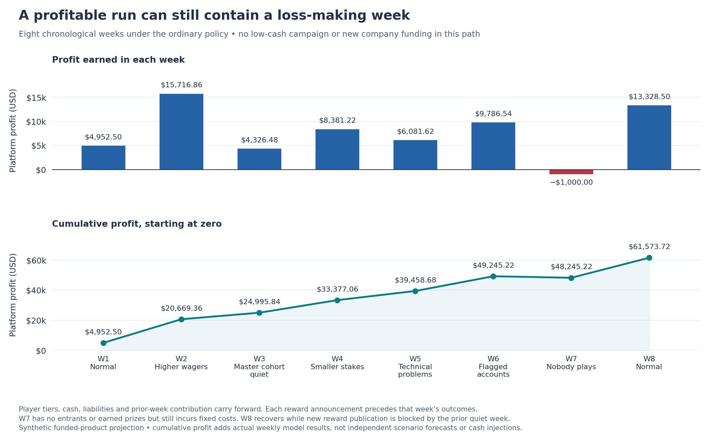

# How platform profit changes over eight weeks

<!-- scenario-quick-reference:start -->
**Before reading:** these are simulated USD amounts; the app currently uses demo credits. A **pool** is shared among a league’s prize winners. **Profit** always belongs to the platform: fees minus modeled costs and rewards. **Available cash** is money left after protecting existing obligations and reserves.

**Low-cash decision:** offer $10,000.00 for one retention week, assuming $10,000.00 of new company cash is received first. If earnings after costs halve, that week loses $3,148.25, but current-plus-next-week profit remains $2,179.25. [See the worked example](REWARD_ANALYSIS.md#why-the-low-cash-pool-can-be-larger).

**Cumulative profit:** in a scenario, add its current week and next forecast week. In the weekly report, add the weeks in order. Start at zero in both examples. Do not add different scenarios together or count new company cash as profit.

Quick reference: what each case name means

- **Normal week (`baseline`):** the usual assumed players, games and stakes; our comparison point.
- **Low available cash (`low_liquidity`):** normal gameplay, less starting cash, plus new company funding for the larger one-week reward offer.
- **Higher wagers (`high_wager`):** stakes rise and players make about 10% more attempts; more fees support larger normal-policy pools.
- **Master players go quiet (`master_quiet`):** all but one original Master player stop; fees fall, but existing prizes are still owed.
- **More games, smaller stakes (`more_games_low_stakes`):** attempts rise about 50%, but lower stakes reduce fees and each attempt still costs money.
- **Technical problems (`outage`):** fewer attempts and more unfinished runs; rewards use a more cautious earnings forecast.
- **Four large flagged accounts (`whale_surge`):** wagering is concentrated; fees involving these deliberately flagged mock accounts are set aside. Large wagers alone do not prove abuse.
- **Cash shortfall (`reserve_deficit`):** existing obligations and reserves exceed available cash; new pools are blocked.
- **Earlier examples (`prior_2`, `prior_1`):** fabricated weeks at roughly 90% and 95% of normal attempts, used to smooth the forecast; they are not observed history.
- **Nobody plays (`platform_quiet`):** used only in the weekly report; no fees or earned prizes, but operating costs continue.

The eight-week report follows the ordinary policy. It does not include the new low-cash retention campaign or its company funding.

<!-- scenario-quick-reference:end -->

This simulated sequence earns **$61,573.72 cumulative platform profit**, including **1 loss-making week**. Cash, player tiers and past results carry from one week into the next. Unlike the independent scenarios, these rows can be added together.

**Scope:** fictional USD data and dates, including future weeks. This path uses the ordinary reward policy. The separately funded $10,000 low-liquidity campaign is only in [SCENARIO_RESULTS.md](SCENARIO_RESULTS.md). Its company funding and two-week profit are not added here.

## See the weekly results

*Read weekly profit for each week’s gain or loss, and cumulative profit for the running total. The fully quiet week loses $1,000 even with no earned rewards, so the running total briefly falls.*

**Columns:** **Week / start** gives the simulated week number and Monday date. **Template** names its imposed activity pattern. **Announced pools** is the total reward offer fixed before play. **Actual awards** is the amount earned. **Platform profit** is fees less withheld suspect fees, costs and earned awards. **Cumulative profit** sums Platform profit from week one.

| Week / start | Template | Announced pools | Actual awards | Platform profit | Cumulative profit |
| --- | ---: | ---: | ---: | ---: | ---: |
| 1 / 2026-09-07 | baseline | $8,376.00 | $8,376.00 | $4,952.50 | $4,952.50 |
| 2 / 2026-09-14 | high_wager | $2,550.00 | $2,550.00 | $15,716.86 | $20,669.36 |
| 3 / 2026-09-21 | master_quiet | $3,100.00 | $3,100.00 | $4,326.48 | $24,995.84 |
| 4 / 2026-09-28 | more_games_low_stakes | $1,450.00 | $1,450.00 | $8,381.22 | $33,377.06 |
| 5 / 2026-10-05 | outage | $1,800.00 | $1,800.00 | $6,081.62 | $39,458.68 |
| 6 / 2026-10-12 | whale_surge | $750.00 | $750.00 | $9,786.54 | $49,245.22 |
| 7 / 2026-10-19 | platform_quiet | $900.00 | $0.00 | -$1,000.00 | $48,245.22 |
| 8 / 2026-10-26 | baseline | $0.00 | $0.00 | $13,328.50 | $61,573.72 |

**Clarifications:**

- Each pool is shared among league winners, not paid to every player. If nobody qualifies, the unused reservation expires; it is not new income.
- Profit belongs to the platform and excludes deposits, withdrawals and company capital. Omitted taxes and financing costs are also outside this model.
- Activity is imposed, not predicted from reward size. The recovery row does not demonstrate that players return after a reward pause.

## Why the unusual weeks look this way

- **Week 1 keeps existing promises:** the $8,376 configured pools and old one-crown eligibility remain in force. Later funded weeks use rising pools and rising minimum crowns.
- **Week 7 is completely quiet:** no attempts means no fees or qualifying awards, but $1,000 fixed cost remains. The unused $900 pool reservation is released.
- **Week 8 has no new reward offer:** that decision used the completed quiet week, before recovery was known. The imposed recovery generates profit that can support week nine. A live reward pause needs backend support.

New pools use completed results and opening available cash; they never use the coming week’s outcomes. The ordinary policy buffers contribution by 20%, assigns 25% of the buffered amount to rewards, and applies quality, growth and qualifier limits. These are adjustable policy assumptions, not an optimized engagement formula.

## The next decision: a $1,000 funded restart

For simulated week nine (2026-11-02), available cash after protection is **$81,573.72**. The contribution rule allows a **$1,694.00** budget, but just **3 forecast Master qualifiers** limit the entire rising ladder to **$1,000.00**, leaving $694.00 unallocated. This small offer is driven by the qualifier policy and recent results, not a shortage of cash. A separately funded recovery campaign could be evaluated as another policy choice.

**Columns:** **League** is the projected final tier. **Minimum crowns** is its fresh weekly prize-eligibility threshold. **Next pool** is its total USD reward budget. **Forecast qualifiers** counts players expected to meet the threshold. **Platform profit** is the tier’s projected fees available to use, minus allocated costs and its full pool.

| League | Minimum crowns | Next pool | Forecast qualifiers | Platform profit |
| --- | ---: | ---: | ---: | ---: |
| Bronze | 1 | $20.00 | 28 | -$14.81 |
| Silver | 5 | $40.00 | 42 | $28.91 |
| Gold | 15 | $60.00 | 33 | $202.41 |
| Platinum | 40 | $80.00 | 11 | $61.93 |
| Sapphire | 100 | $120.00 | 41 | $843.91 |
| Ruby | 200 | $160.00 | 79 | $3,757.49 |
| Diamond | 400 | $220.00 | 60 | $6,917.66 |
| Master | 800 | $300.00 | 3 | $531.00 |

**Clarifications:**

- Crowns reset weekly and come from winning credits, including returned stake. Minimum crowns are not deposits or promotion thresholds; qualifying does not guarantee a prize.
- Per-league profit is allocated platform profit, not player profit. This forecast repeats recovery-week activity and charges every proposed pool in full.
- This recommendation follows eight weeks of changing membership and contribution; it is different from the independent baseline’s $2,600 offer. Restarting after zero resets only the growth limit.

Check the weekly profit arithmetic

**Columns:** **Week** matches the sequence above. **Gross fees** is settled match-fee revenue. **Withheld fees** is suspect-contest revenue kept unavailable. **Costs** combines processing, attempts, fixed operations and fraud losses. **Awards** is earned prize expense. **Profit** equals Gross fees minus the next three columns.

| Week | Gross fees | Withheld fees | Costs | Awards | Profit |
| --- | ---: | ---: | ---: | ---: | ---: |
| 1 | $15,171.40 | $0.00 | $1,842.90 | $8,376.00 | $4,952.50 |
| 2 | $20,134.00 | $0.00 | $1,867.14 | $2,550.00 | $15,716.86 |
| 3 | $9,199.60 | $0.00 | $1,773.12 | $3,100.00 | $4,326.48 |
| 4 | $11,795.60 | $0.00 | $1,964.38 | $1,450.00 | $8,381.22 |
| 5 | $9,664.00 | $0.00 | $1,782.38 | $1,800.00 | $6,081.62 |
| 6 | $17,227.00 | $4,828.00 | $1,862.46 | $750.00 | $9,786.54 |
| 7 | $0.00 | $0.00 | $1,000.00 | $0.00 | -$1,000.00 |
| 8 | $15,171.40 | $0.00 | $1,842.90 | $0.00 | $13,328.50 |

**Clarifications:**

- Regular weeks assume $20,000 deposits and $5,000 withdrawals, with $500 processing cost. The quiet week has none of these cash flows.
- The independent scenario model uses different deposit assumptions and $125 processing cost. Identical activity labels need not produce identical profit across the two reports.

Check cash and player obligations

The path starts with $60,000 cash, $30,000 owed in wallets, $3,000 other player obligations and $7,000 operating/risk buffers. That leaves $20,000 before reserving the first pool.

**Columns:** **Week** matches the sequence. **Cash** is closing settled cash. **Wallet owed** is the closing amount owed to players. **Withheld stock** is accumulated protected suspect-fee money. **Free cash** subtracts Wallet owed, Withheld stock, the unchanged $3,000 other obligations and $7,000 buffers from Cash, before reserving the following pool.

| Week | Cash | Wallet owed | Withheld stock | Free cash |
| --- | ---: | ---: | ---: | ---: |
| 1 | $73,157.10 | $38,204.60 | $0.00 | $24,952.50 |
| 2 | $86,289.96 | $35,620.60 | $0.00 | $40,669.36 |
| 3 | $99,516.84 | $44,521.00 | $0.00 | $44,995.84 |
| 4 | $112,552.46 | $49,175.40 | $0.00 | $53,377.06 |
| 5 | $125,770.08 | $56,311.40 | $0.00 | $59,458.68 |
| 6 | $138,907.62 | $54,834.40 | $4,828.00 | $69,245.22 |
| 7 | $137,907.62 | $54,834.40 | $4,828.00 | $68,245.22 |
| 8 | $151,064.72 | $54,663.00 | $4,828.00 | $81,573.72 |

**Clarifications:**

- Deposits increase cash and the wallet amount equally; withdrawals decrease both. Neither creates profit. Pending processor funds are excluded.
- Fees reduce wallet obligations; they are not added to cash again. Awards increase wallet obligations, and later withdrawal is not a second prize expense.
- Because other protected stocks stay fixed, the weekly increase in Free cash exactly equals platform profit. Unused prize reservations are released without being counted as revenue.

`closing cash = opening cash + deposits − withdrawals − costs`

`closing wallet = opening wallet + deposits − withdrawals − gross fees + awards`

Full weekly ladders, decisions and player states are in [weekly_profit.json](../data/output/weekly_profit.json). Generation commands are in [README.md](README.md). The script checks cash/profit reconciliation, tier continuity and funded commitments; those checks validate the arithmetic, not the assumed player response.

**Recommendation:** reserve the $1,000 ordinary-policy restart before announcing it. If stronger rewards are needed for recovery, compare a separately funded one-week campaign with an explicit loss budget, cumulative-profit horizon and measured player response. Preserve all earned awards and review the next unannounced offer after the results are known.
